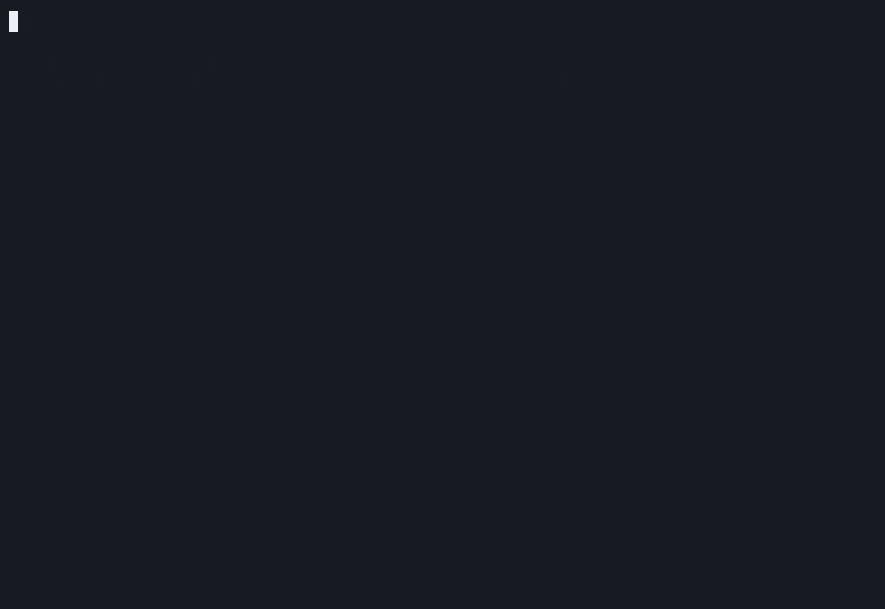
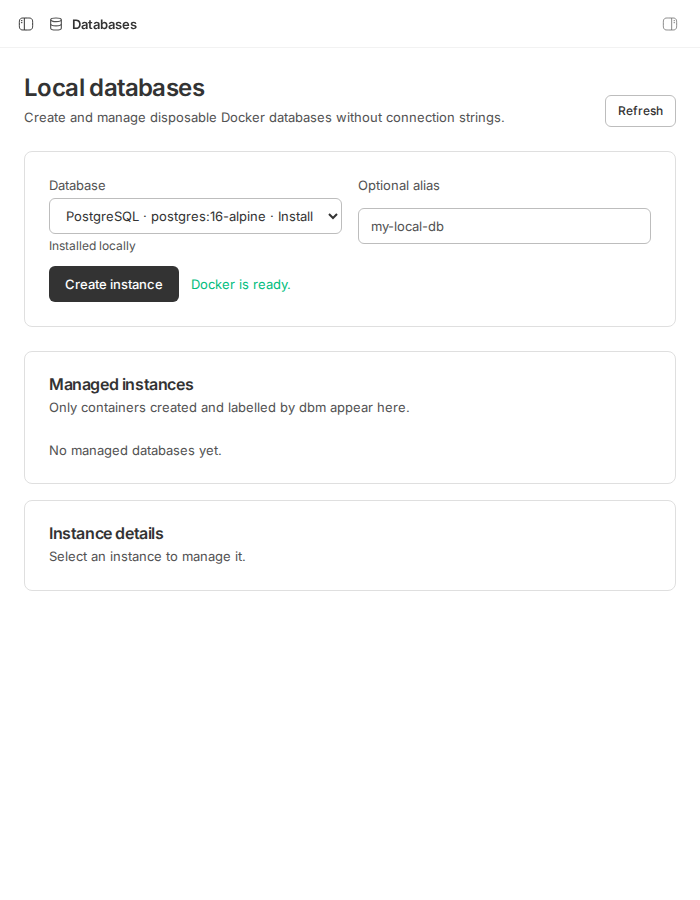

# dbm


[](https://github.com/celeroncoder/dbm/actions/workflows/ci.yml)
[](https://github.com/celeroncoder/dbm/actions/workflows/codeql.yml)
[](https://github.com/celeroncoder/dbm/actions/workflows/docker-smoke.yml)
[](https://github.com/celeroncoder/dbm/releases)
[](LICENSE)

Local database containers are easy to start and surprisingly awkward to inspect. `dbm` discovers supported containers through Docker, reads their connection metadata, and runs the native database client inside the container, so there are no connection strings or host-side client installs to manage.

The terminal CLI explores any supported local container. The optional BB plugin adds a Databases panel and safe lifecycle management for containers it creates.



## Install the CLI

The CLI ships as a versioned package tarball on GitHub Releases; the command is `dbm`. Bun 1.4 or newer and a working Docker engine are required.

```sh
bun add --global https://github.com/celeroncoder/dbm/releases/download/v0.1.0/celeroncoder-dbm-0.1.0.tgz
dbm --version
dbm
```

To remove it:

```sh
bun remove --global @celeroncoder/dbm
```

## Try it in 60 seconds

Start a disposable Postgres container, open `dbm`, then choose the container and browse or query it:

```sh
docker run --detach --rm \
  --name dbm-quickstart-postgres \
  --env POSTGRES_PASSWORD=dbm \
  --env POSTGRES_DB=app \
  postgres:17-alpine

dbm
docker stop dbm-quickstart-postgres
```

`dbm` can inspect containers you created yourself. It does not need to own them and does not mutate or delete discovered containers.

Docker daemon access is effectively root access to the host. Use dbm only on a trusted local development machine. The plugin binds managed ports to `127.0.0.1`, uses disposable development credentials, and deletes only containers whose inspected metadata confirms `com.dbm.managed=true` ownership.

## Install the BB plugin

The repository is a BB plugin collection. Install a tagged release from GitHub, then verify the plugin and its CLI surface:

```sh
bb plugin install git:https://github.com/celeroncoder/dbm.git@0.1.0 --plugin dbm --yes
bb plugin list
bb dbm images
bb dbm create postgres local-postgres
bb dbm connect local-postgres
bb dbm delete local-postgres
```

The plugin adds a Databases panel for creating localhost-only Postgres, MySQL, Redis, and MongoDB instances. It also provides `bb dbm` commands for scripted and agent-driven use.



Managed containers carry `com.dbm.managed=true` and a stable dbm instance ID. Lifecycle operations and cleanup require those labels and use the exact Docker container ID. Containers merely discovered by the CLI are never treated as managed.

See [BB plugin usage](docs/bb-plugin.md) for the full command surface and development install.

## CLI commands

| Command | Purpose |
| --- | --- |
| `dbm` | Open the interactive discovery and exploration UI. |
| `dbm doctor` | Check Bun, platform support, Docker, optional OrbStack and BB commands, detected databases, and native-client connectivity. |
| `dbm doctor --json` | Print the same diagnostics as versioned JSON for scripts. |
| `dbm completions bash` | Print bash completions. Replace `bash` with `zsh` or `fish` as needed. |
| `dbm --help` | Show usage. |
| `dbm --version` | Print the dbm version. |

Load completions for the current shell session with `source <(dbm completions bash)`, `source <(dbm completions zsh)`, or `dbm completions fish | source`.

## Supported databases

| Database | Default managed image | Native client | Discovery | Query | Schemas or databases | Browse and describe | Managed instance |
| --- | --- | --- | --- | --- | --- | --- | --- |
| PostgreSQL | `postgres:16-alpine` | `psql` | yes, including PostGIS and pgvector signals | yes | yes | tables and rows | yes |
| MySQL / MariaDB | `mysql:8.4` | `mysql` | yes, including MariaDB signals | yes | yes | tables and rows | MySQL only |
| Redis / Valkey | `redis:7-alpine` | `redis-cli` | yes, including Valkey signals | yes | keyspaces | keys and values | Redis only |
| MongoDB | `mongo:7` | `mongosh` or `mongo` | yes | yes | yes | collections and documents | yes |

The client must exist inside the image. The CLI uses environment metadata from Docker inspection and does not expose container environment variables in its output.

## Prerequisites and tested versions

| Component | Requirement | CI or release baseline |
| --- | --- | --- |
| Bun | 1.4 or newer | 1.4.0 |
| Docker | Engine reachable by the current user | Docker 29 |
| OrbStack | Optional macOS startup integration providing `orb start` | Not required in CI; verify current stable release before tagging |
| BB plugin host | BB 0.39 or newer | 0.39.0 |
| Platforms | Linux and macOS | Ubuntu 24.04, macOS 15 |

Windows is not supported for the first release. WSL2 may work when its Linux environment can reach Docker, but it is not part of the release test matrix.

If Docker is unavailable, the CLI can offer to start OrbStack on macOS. For socket permission errors it retries with non-interactive `sudo -n docker`; it never asks for or stores a sudo password. Prefer granting your user access to the Docker socket.

## Safety and privacy

- The CLI only inspects containers and executes read-oriented database commands chosen by the user.
- The BB plugin publishes database ports on `127.0.0.1`, never all interfaces.
- Only explicitly labelled dbm-managed containers can be stopped, restarted, paused, or deleted by the plugin.
- Failed creates and deletions clean up the exact container ID and anonymous volumes attached by the image.
- No credentials, query text, database contents, or telemetry leave the machine.
- Database queries can still change data. Review a query before running it and use least-privilege database users where possible.

Read [Docker safety](docs/docker-safety.md), [security policy](SECURITY.md), and [troubleshooting](docs/troubleshooting.md) before using dbm with sensitive local data.

## Development

```sh
bun install
bun run check:repository
bun run check
bun run test
```

Run from source with `bun run dev`. For a global command linked to the checkout:

```sh
bun run link:global
dbm
bun run unlink:global
```

The repository's `prepare` script clones Effect into the ignored `.repos/effect` directory when needed for local source reference.

Plugin development uses its own lockfile:

```sh
cd bb-plugin-dbm
npm ci --install-links
npx bb plugin types --check
npm run check
npm run test
npm run build
```

The opt-in live suite creates one temporary container for every adapter and removes each by exact ID:

```sh
bun run verify:docker
```

On a space-constrained development host, run one adapter without changing the release suite: `DBM_VERIFY_KINDS=postgres bun run verify:docker`. Accepted comma-separated values are `postgres`, `mysql`, `redis`, and `mongo`.

## Architecture and extension

The terminal and BB outlets share an Effect service graph for command execution, Docker access, discovery, adapters, exploration, and managed lifecycle. Start with [architecture](docs/architecture.md) and [adapter authoring](docs/adapter-authoring.md).

Examples are available for [Postgres](examples/postgres.md), [MySQL](examples/mysql.md), [Redis](examples/redis.md), and [MongoDB](examples/mongodb.md). Contributor setup and release policy live in [CONTRIBUTING.md](CONTRIBUTING.md) and [release process](docs/releases.md). Near-term choices are recorded in the [roadmap](docs/roadmap.md).

## Limits and non-goals

- dbm is a local Docker database explorer, not a production database administration system.
- It does not connect to remote hosts, Kubernetes, or cloud database services.
- It does not replace backup, migration, or schema-management tools.
- JSON output is currently limited to `dbm doctor --json` and the BB CLI's structured operations. The interactive explorer is intentionally human-oriented.

Project support is handled through [GitHub Issues](https://github.com/celeroncoder/dbm/issues). dbm is licensed under the [MIT License](LICENSE).
