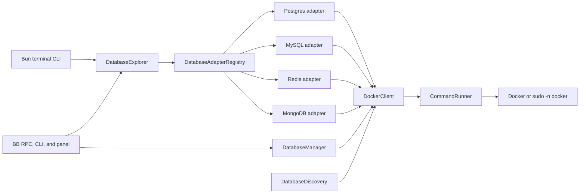

# Architecture

dbm has one Effect core and two user-facing outlets.

## Process boundary

`CommandRunner` is the only raw process boundary. The Bun terminal uses
`CommandRunnerLive` from `command-bun.ts`; the BB server uses the Node runner
from `command.ts`. Both return stdout, stderr, and exit status through the same
typed service.

`DockerClient` owns Docker readiness, OrbStack startup, socket-permission
fallback, structured container listing and inspection, image inspection,
container execution, logs, and lifecycle commands. Container references are
validated and passed after an explicit option boundary.

## Discovery and adapters

`DatabaseDiscovery` scans running containers and recognizes supported image,
name, and label signals. It inspects environment and label metadata when
available, but still lists a supported discovered container when inspection
fails.

`DatabaseAdapterRegistry` selects one adapter by `DatabaseKind`.
`DatabaseExplorer` delegates query, connection test, schema or keyspace list,
table or key or collection list, describe, and bounded browse operations.
Native clients run inside the target container.

## Managed instances

`DatabaseManager` is used by the BB outlet. It creates localhost-only
containers from fixed templates, labels them as dbm-owned, waits for native
readiness, returns connection details, and exposes logs and lifecycle methods.
Create failures remove the exact ID returned by Docker. Deletion resolves an
entry from the managed list, revalidates its inspected ownership label, and
removes its exact ID plus any anonymous volume attached by the image.

The terminal CLI discovers existing containers. The BB outlet can both manage
dbm-owned containers and explore them through the shared adapters.

## Runtime composition

The terminal builds layers once in `src/main.ts` and provides them to the CLI
program. The BB plugin builds one `ManagedRuntime` because RPC and CLI handlers
are separate framework entry points. Plugin disposal closes that runtime.
